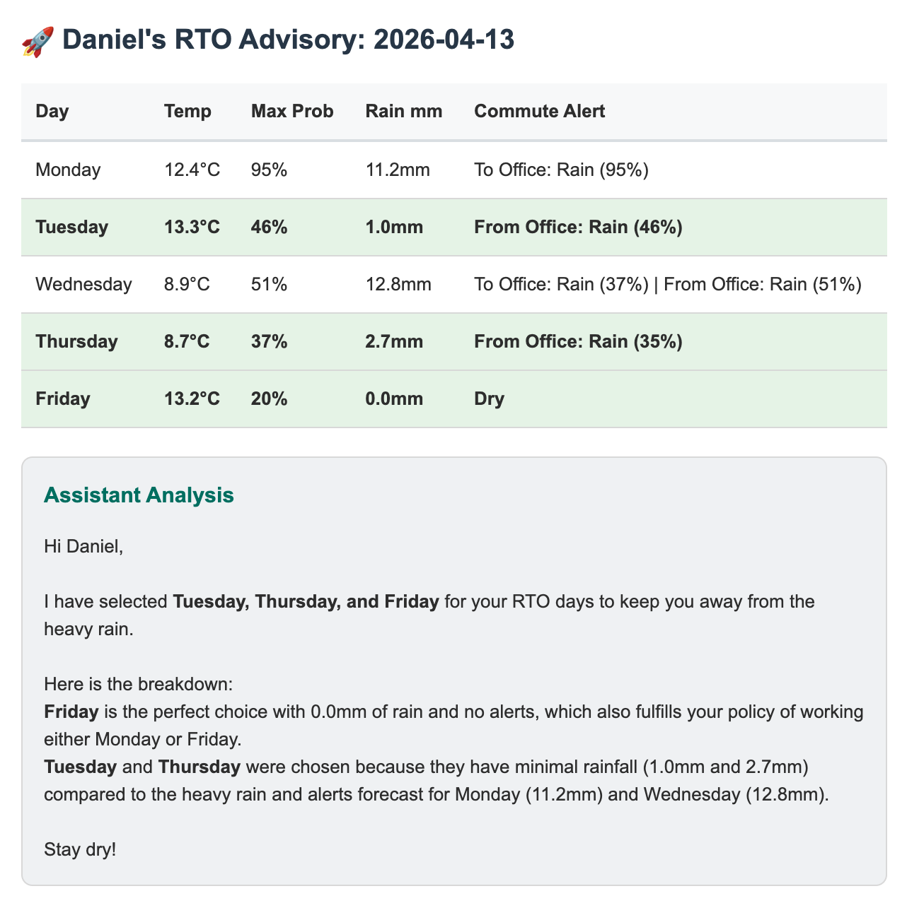

# 🌦️ RTO Weather Advisor

An AI agent that analyzes weather forecasts to determine the most comfortable 3 days to commute, ensuring you avoid rain, snow, and freezing temperatures while adhering to corporate scheduling policies.

## 📸 Example Email Report

## 🌟 Features
- **Weather Analytics** — Fetches 10-day forecasts from the Open-Meteo API.
- **Commute Scoring Logic** — Calculates a "Quality Penalty" by specifically weighting commute hours (8:00 AM and 4:00 PM) against precipitation probability and temperature.
- **Policy Enforcement** — Automatically finds the best 3-day combination that includes a mandatory Monday or Friday (per typical office policies).
- **AI-Powered Reasoning** — Uses Google Gemini (Gemma-4.3) to provide a natural language explanation of why specific days were chosen
- **HTML Email Reports** — Sends a beautifully formatted dashboard directly to your inbox with commute alerts and temperature summaries.
- **Cloud-Native** – Designed to run as a stateless function on Google Cloud Run or AWS Lambda.

## Tech Stack
- **Language** — Python 3.11+
- **Gemini AI (Gemma 4)** — natural language explanation
- **Open-Meteo API** — free weather data
- **Gmail SMTP** — email delivery
- **Google Cloud Run** — serverless deployment + scheduled trigger

## Setup

### Prerequisites
- Python 3.11+
- A Google Cloud project with Cloud Run enabled
- A Gmail account with an App Password

### Requirement.txt
- requests
- pandas
- google-genai
- python-dotenv

### Environment Variables
- RECEIVER_EMAIL=your-email@example.com
- SENDER_EMAIL=your-sender@gmail.com
- SENDER_APP_PASSWORD=your-gmail-app-password
- GOOGLE_API_KEY=your-gemini-api-key

### 📊 How the Scoring Works
- **Freezing Rain** — -100 points (Highest priority avoidance)
- **Rain** — 70 points
- **Snow** — -40 points
- **Commute Multiplier** — Penalties are multiplied by 4.0 if they occur during the 8 AM or 4 PM windows.
- **Probability Multiplier** — High-certainty rain (90%+) carries more weight than "slight chances."

## Development
The notebook (`rto-weather-agent.py`) contains the development process, including code cells for creating and testing the agent in Google Colab.

## About
Built by Daniel Young as a portfolio project to showcase applied data science skills in multi-source API integration, data processing, and LLM-driven automation, using a Python-based agent to deliver daily weather and RTO day selectio recommendations for improving commute life.

## License
MIT License - feel free to use and modify the code!
